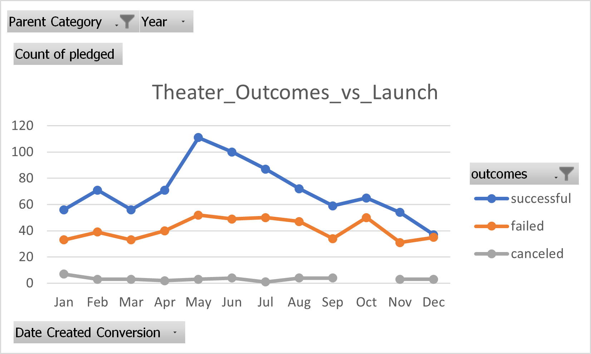
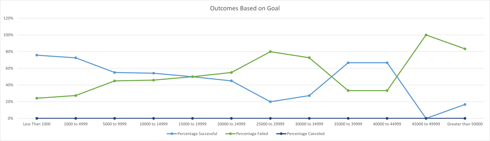

# Kickstarting with Excel

## Overview of Project

Louise wants to raise funds for a play called 'Fever'. I helped her research and analyze other previous fundraisers and she was able to come close to her fundraising goal in short amount of time. Louise would like to do a detailed comparison between her and other campaigns.

### Purpose

Louise wants to compare her campaign with others based on launch date and goals. I will analyze and create visual aids (charts) to help her with this analysis.

## Analysis and Challenges

Fundraising data had goals and outcomes for various types of campaigns. Since Louise was primarily interested in theatre, we tried to scope our data within theatre categories and play subcategories. Complete analysis can be found here: [Fundraiser_Analysis](https://github.com/amangill09/working_with_excel/blob/8a49c3277ee9e495273145104728ef17005b62ed/Kickstarter_Challenge.xlsx). The detailed analysis is provided in the sub-topics that follow. 

### Analysis of Outcomes Based on Launch Date

Analysis based on launch date showed that fundraisers in Theatre category are most successful in months of May and June. I further confirmed my theory by selecting May as a filter and Year as Rows in pivot table. I have provided a Line chart with markers to support my analysis:   

### Analysis of Outcomes Based on Goals

Another way to identify a criterion for success is based on Goal amount. In this analysis, I split the goal in increments of $5,000 and identified the success and fail percentages. Data showed that a smaller goal amount has more chances for success. There were a few exceptions but the quantity was not significant. Outcomes are presented in this chart

### Challenges and Difficulties Encountered

The following two challenges were observed during the analysis:
    1. Connecting data and requirements: One of the main challenge was to understand the data and connect it with Louise's requirements. If she is interested in USA and UK, then reviewing Asian markets was an effective approach. Similarly, Games category has little influence over the success of Theatre fundraisers. I overcame this challenge by reviewing the requirements and then scoping the data for analysis (example: only look at Theatre category).
    2. Outliers: Data can get skewed if there is a large outlier impacting the measures of central tendency and spread (mean, median etc.). It becomes a challenge to conclude research if outliers are not excluded. I used box plot to identify outliers and validate if they were true outliers. No outliers were found in Theater and play categories and sub-categories. 

## Results

- What are two conclusions you can draw about the Outcomes based on Launch Date?
    1. Louise should launch her campaign in the months of May and June. Over 65% of Theatre campaigns were successful in those two months. 
    2. If we try to analyze all of the data, then February becomes a good contender as well. It has same percentage of successful campaigns. 

- What can you conclude about the Outcomes based on Goals?
    1. Louise should keep her campaign Goal well under 25,000 USD. Campaigns with goals higher than $25K did not have high success rate. It seems that people get demotivated with campaigns that have high fundraising goals. 

- What are some limitations of this dataset?
    1. This data does not have large historical data. When I tried to review all Theatre campaigns in the month of May, I only got three years of data. I would like to see a data set that shows a historical trend.
    2. Data shows average donation but it doesn’t not show the spread. It is possible that some campaigns had a single large donor (example a rich friend or relative) who skewed the data for rest of the donors. It would be helpful to add more data points like median and IQRs for individual donations. We can then exclude some campaigns from our analysis if the data skews highly to a single donor. 

- What are some other possible tables and/or graphs that we could create?
    1. We can create a line chart based on average donation and identify if an Outcome trend comes out of it. There is a possible link between average donation and success rate of a campaign. 
    2. A Radar graph is another good way to look at outcomes by launch date. It presents a circular visual that shows which month had the most successful outcomes. One benefit of radar chart is that we can add more layers and identify trends on wide variety of data.

